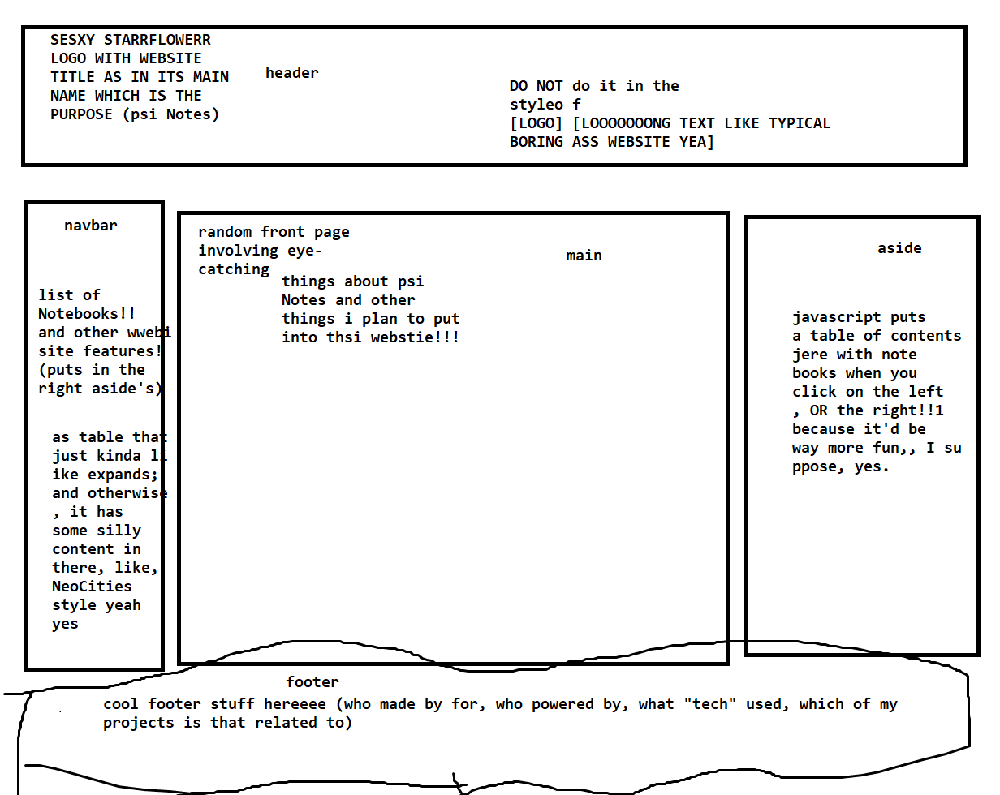

## Website design project

### Second design draft

*`-=- [ Coming Relatively Soon ] -=-`*

### First design draft

Erm... I know how this looks like! But I ***promise*** you, dear **curious recruiter browsing this repository** ("I know what you are", as kids on the internet say!), but I ***promise*** you that this project will soon enough turn into some *peak* self-advertisement for employing me! Now, can you imagine - a developer, engineer, and also an artist, writer, survivor of many hardships, and **YET** *even more*: a ***self-taught marketing professional*** - just stop whatever you're doing for a moment, and *THINK* about it:

##### You really want me at your company! Please hire me! Please do not be scared of this MS Paint "design draft"! I've spent 4 years at a IT/"CS" university, and seen apparently certified professionals commit worse "acts of treason" against *The Craft Of Computers!!!* `(please please please hire me, I'm a minority with 7 targets on my back, I need money and stable employment so bad)`

